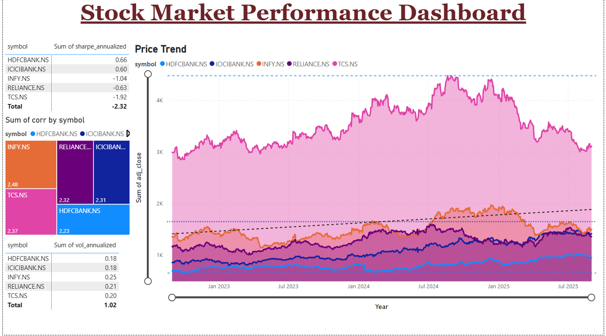

# Stock_Market_Performance_Dashboard_and_Risk_Analysis

A refreshable dashboard for analyzing and visualizing price trends, risk metrics (volatility, Sharpe), and correlations for major Indian listed stocks using **Power BI** and **Python (Google Colab)**.

---

## Table of Contents
- [Overview](#overview)
- [Features](#features)
- [How It Works](#how-it-works)
- [Getting Started](#getting-started)
- [Data Preparation (Python in Colab)](#data-preparation-python-in-colab)
- [Power BI Integration](#power-bi-integration)
- [Visuals in the Dashboard](#visuals-in-the-dashboard)
- [FAQ](#faq)
- [References](#references)

---

## Overview

This project lets you monitor and compare market trends, volatility, and risk metrics for stocks (e.g., NIFTY companies). Data is automatically fetched using [yfinance](https://pypi.org/project/yfinance/) and processed in Python (works directly in [Google Colab](https://colab.research.google.com/)), then visualized in Power BI as an interactive dashboard.

---

## Features

- 📈 **Price Trend Chart** – Adjusted close price trends for selected stocks, interactive and filterable.
- ⚡ **Risk Metrics Table** – Annualized volatility and Sharpe ratio for each stock.
- 🟥 **Correlation Heatmap** – Visualize how stocks are correlated (diversification insight).
- 🧩 **No Local Python Needed** – Data prep is done in Google Colab; just download CSVs and import to Power BI.
- 💡 **Ready for Refresh** – Simply rerun the Colab notebook to update the data.

---

## How It Works

1. **Fetch & Calculate:** Use the provided Colab notebook to download daily price data from Yahoo Finance and compute returns, volatility, Sharpe ratio, and correlation.
2. **Export:** The notebook will output three CSV files: `prices.csv`, `metrics.csv`, and `corr_long.csv`.
3. **Visualize:** Import these CSVs into Power BI and build out the dashboard visuals.

---

## Getting Started

### Prerequisites

- [Power BI Desktop](https://powerbi.microsoft.com/desktop)
- [Google Colab](https://colab.research.google.com/) (no installation needed)

---

## Data Preparation (Python in Colab)

1. **Open** the [provided Colab notebook](./Stock_Market_Performance_Dashboard.ipynb).
2. **Edit** the `SYMBOLS` list for your chosen Indian stocks, for example:
   SYMBOLS = ["RELIANCE.NS", "TCS.NS", "INFY.NS", "HDFCBANK.NS", "ICICIBANK.NS"]
3. **Run all cells.**  
The notebook will:
- Download price data.
- Calculate rolling returns, volatility, Sharpe ratio.
- Compute a correlation matrix.
- Export `prices.csv`, `metrics.csv`, `corr_long.csv`.

4. **Download** the three CSV files to your local machine.

---

## Power BI Integration

1. **Import the data:**
- `Get Data > Text/CSV`, select each CSV, and load into Power BI.
- Rename tables if desired for clarity (`prices`, `metrics`, `corr_long`).

2. **Build your visuals:**  
See [Visuals in the Dashboard](#visuals-in-the-dashboard) below for suggestions.

3. **Publish/report/refresh:**
- Design your dashboard layout as shown in the screenshot.
- For updates, rerun the Colab notebook and replace the CSV files in your PBIX file.

---

## Visuals in the Dashboard

**Recommend visualizations (see dashboard image above):**

- **Price Trend** (Line/Area Chart):  
 - *X:* Date  
 - *Y:* Adjusted Close  
 - *Legend:* Symbol  
 - Overlays: trend line, average line, period slider

- **Risk Metrics (Table)**:  
 - *Columns:* Symbol, Sharpe Ratio, Volatility

- **Correlation Heatmap (Matrix + Conditional Formatting):**  
 - *Rows/Columns:* Symbol  
 - *Values:* Correlation coefficient  

- **Sum-of-Correlation Treemap:**  
 - *Groups/Size:* Sum of correlation by symbol for quick diversification check

- **Slicers:**  
 - Symbol, Date range (supports comparative and drill-down analyses)

- **(Optional) KPI/Cards:**  
 - Latest Volatility or Sharpe ratio for selected symbol(s)

---

## FAQ

**Q: Can I use BSE stocks?**  
A: Yes, change to `.BO` (e.g., `RELIANCE.BO`).

**Q: Do I need to install Python?**  
A: No, just use Google Colab in your browser.

**Q: Can I refresh data automatically?**  
A: Rerun the Colab notebook and overwrite your .csv files; Power BI will update visuals on re-import or scheduled refresh (OneDrive/SharePoint/gateway).

**Q: What is `corr_long`?**  
A: It's a "long" (stacked) form of the correlations between daily returns of stocks—one row per pair for easy use in Power BI's Matrix visual.

---

## References

- [Power BI Documentation](https://learn.microsoft.com/en-us/power-bi/)
- [yfinance Docs](https://github.com/ranaroussi/yfinance)
- [Correlation Matrix Explanation](https://www.investopedia.com/terms/c/correlation.asp)
- [Sharpe Ratio Explanation](https://www.investopedia.com/terms/s/sharperatio.asp)

---

> **Project by: Vinay Kumar**  

